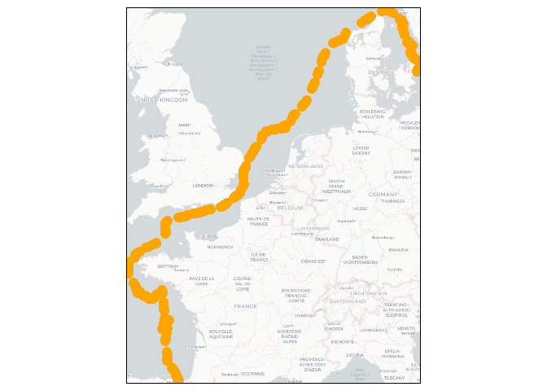

# Tres Hombres meteo map

# Introduction

The Tres Hombres is the only engineless cargo ship in the world.

During the year it undertakes numerous trips around the world carrying
high values cargo such as cocoa, rum, wine and olive oil from producers
to markets. I travelled on one such trip this summer. The meteo data
onboard was limited and I was curious to retrospectively analyse the
conditions, where the boat was, but also surrounding. Such data is
readily available for anyone and could be used to improve the efficiency
and safety of voyages.

The route looked like this:

This repository includes the gpx file in the data folder recorded on my
watch every 15 minutes (whilst on deck). The coordinates are imported
from this in script 01_download_data.R and used to download data for 8
parameters I thought would be interesting:

- 10m_u_component_of_wind  
- 10m_v_component_of_wind  
- 2m_temperature  
- sea_surface_temperature  
- total_precipitation  
- surface_solar_radiation_downwards  
- mean_direction_of_total_swell  
- k_index

from the ECMWF Climate data store (cds). This is free for anyone to use
but requires an account to be created. Once you have an account, get the
API and paste it into the function get_era.

02_plot_meteo.R imports this data and creates pngs for each hour and
variable 03_write_movie.R arranges these on the screen and writes a few
frames 04_stitch_movie.R compiles the seperate mp4 files into a single
file

Video is large so is published here: https://youtu.be/rMY-oUCxwYo
